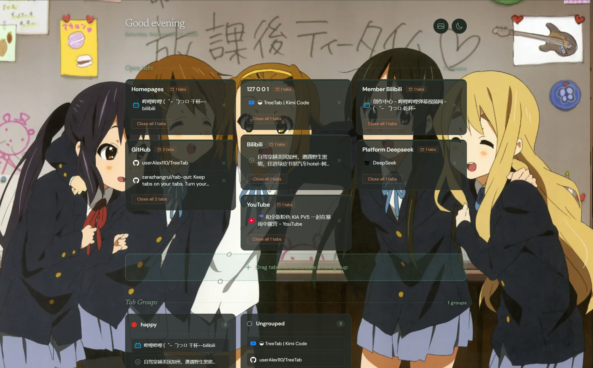

# TreeTab

把 Chrome 新标签页变成一块看板，用来管理你的标签页。

> 这是一个**玩儿的项目**（playground）——用 AI 编码工具边玩边写的 Chrome 扩展，功能以自己够用为准，不承诺长期维护。

## 它做什么

新标签页变成上下两块看板：

- **上面**：所有标签页按域名自动聚合，重复页面高亮、一键清理；一屏放不下的长列表可以展开
- **下面**：Chrome 原生标签组的卡片视图，支持拖拽、重命名、一键关闭（没有分组时这一块自动隐藏）

外加：**实时更新**（在别的标签页开关、切换分组、改名，看板约 0.3 秒内自动同步）、彩纸与音效、自定义背景图、暗色模式、工具栏徽章计数（绿/黄/红提示标签数量健康度）、空窗口时的 "All clear" 空状态。批量关闭（关掉某张卡片的全部标签页）与删除分组都需要点两次确认，钉住的标签页不会被批量关掉。

**100% 本地**。无服务器、无账户、无外部 API，字体也是本地打包的 —— 新标签页不会发起任何第三方请求，数据全在 `chrome.storage.local`，永不离开你的设备。

## 安装

1. `git clone` 本仓库（或下载 ZIP 解压）
2. 打开 `chrome://extensions`，开启右上角**开发者模式**
3. 点**加载已解压的扩展程序**，选择 `extension/` 子文件夹（不是仓库根目录）
4. 开一个新标签页，完成

> 也可以直接把仓库链接扔给编码 Agent，说 "install this"。

## 技术

Chrome Manifest V3，**无构建步骤**——`extension/` 里的 HTML/CSS/JS 就是全部源码，改了重载扩展即生效。音效由 Web Audio API 合成，没有音频文件；字体是 `extension/fonts/` 里的可变字体（OFL 1.1 许可），favicon 直接取浏览器给每个标签页的图标，不查任何在线服务。

## 文档约定

改代码时**同步更新所有文档**（README、AGENTS.md 等）。本项目主要由 AI 维护，文档就是 AI 的记忆，过期的文档等于失忆。

## 致谢与许可

基于 [TabOut](https://github.com/zarazhangrui/tab-out)（MIT）开发而来，感谢原作者。本项目同样以 [MIT](LICENSE) 许可发布。
